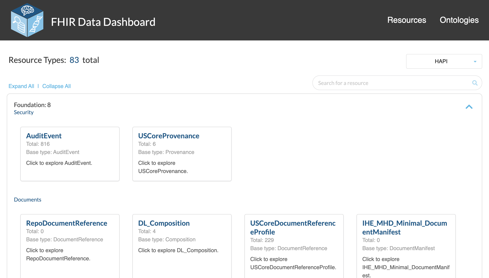
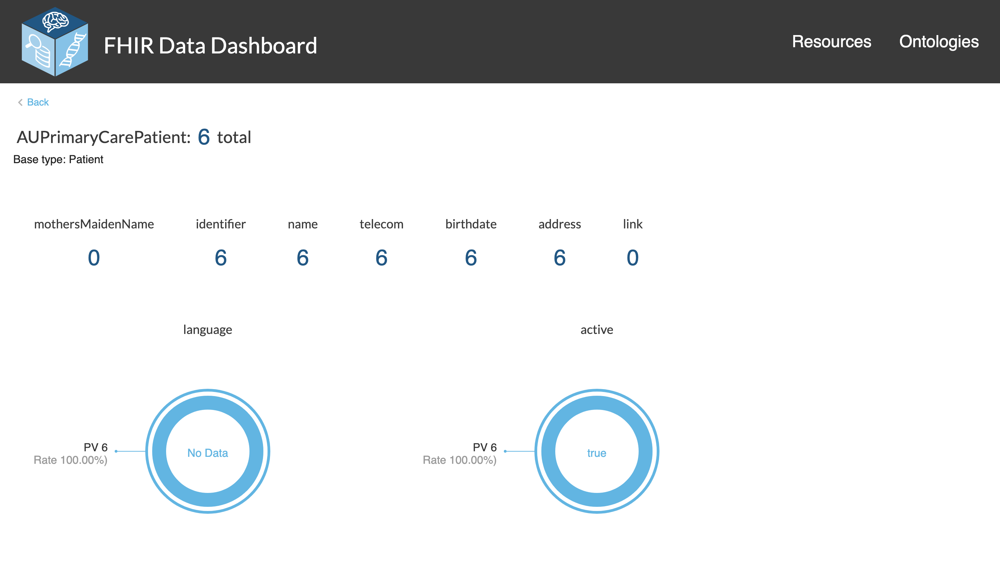
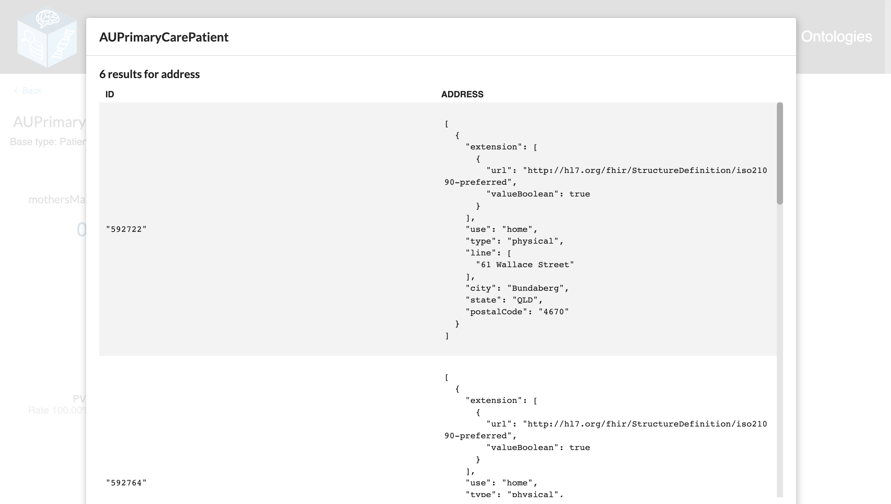
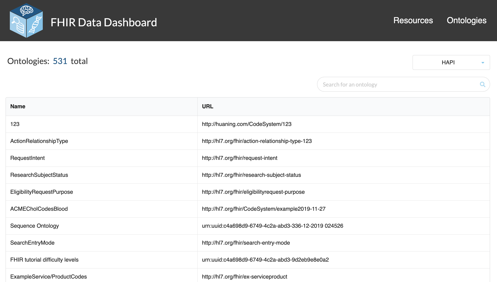

# FHIR Data Dashboard Design Doc

## Requests

The following tables list the requests that need to be sent to a FHIR server in order to construct each page of the FHIR Data Dashboard.

### Homepage

| Step | Request Purpose                            | Request URL                                                                  | Notes                                                                  |
| ---- | ------------------------------------------ | ---------------------------------------------------------------------------- | ---------------------------------------------------------------------- |
| 1    | Fetch all resource types available         | `${baseUrl}/StructureDefinition`                                             | Goes through all available pages (Bundles) and then return all results |
| 2    | Get the total count for each resource type | `${baseUrl}/${resourceType}?_profile:below={resourceTypeUrl}&_summary=count` |

### Details Page

| Step | Request Purpose                                                                                                   | Request URL                                                                                                                                                                                                                                 | Notes                                                                                                  |
| ---- | ----------------------------------------------------------------------------------------------------------------- | ------------------------------------------------------------------------------------------------------------------------------------------------------------------------------------------------------------------------------------------- | ------------------------------------------------------------------------------------------------------ |
| 1    | Fetch the total count of the resource, if it's not already in the Redux store                                     | If it's a resource that doesn't conform to a profile: `${baseUrl}/${resourceType}&_summary=count`  Otherwise: `${baseUrl}/${baseType}?_profile:below=${resourceUrl}&_summary=count`                                             |                                                                                                        |
| 2    | Get the resource schema                                                                                           | `${baseUrl}/StructureDefinition/${resourceId}/$snapshot`                                                                                                                                                                                    |                                                                                                        |
| 3    | Get the available search parameters for the resource                                                              |                                                                                                                                                                                                                                             | This could be an area where a query is unnecessary - is everything stored in the Capability Statement? |
| 3a   | Fetch the search parameters defined for the resource                                                              | `${baseUrl}/SearchParameters?base=${baseType}`                                                                                                                                                                                              |                                                                                                        |
| 3b   | Fetch the default search parameters for the resource                                                              | `${baseUrl}/metadata`                                                                                                                                                                                                                       |
| 4    | Iterate over each attribute in the schema, look for extensions, and get the "type" information from the extension | `${baseUrl}/StructureDefinition?url=${extensionUrl}`                                                                                                                                                                                        |
| 5    | Go through all the attributes from the parsed schema and get the queryable values for that attribute              |                                                                                                                                                                                                                                             |                                                                                                        |
| 5a   | Get the Code System associated with the Value Set                                                                 | `${baseUrl}?ValueSet=${attributeValueSetUrl}`                                                                                                                                                                                               |                                                                                                        |
| 5b   | Get the values that are in each Code System                                                                       | `${baseUrl}?CodeSystem?url=${system}`                                                                                                                                                                                                       | For example, if the attribute is "gender", this could return "Male", "Female", "Other", and "Unknown"  |
| 6    | Get the counts for each value of each attribute in the schema                                                     | For attributes with value sets: `${baseUrl}/${baseType}?_profile:below={resourceTypeUrl}&{attribute}={value}`  For string attributes: `${baseUrl}/${resourceBaseType}?_profile:below={resourceTypeUrl}&attribute:missing=false` | For strings, this returns how many resources of this type have this attribute available                |

#### Details Table

| Step | Request Purpose                                      | Request URL                                                                                                                                                                                                                                                                                     | Notes                                                                                                         |
| ---- | ---------------------------------------------------- | ----------------------------------------------------------------------------------------------------------------------------------------------------------------------------------------------------------------------------------------------------------------------------------------------- | ------------------------------------------------------------------------------------------------------------- |
| 1    | Get detailed resource results for an attribute query | If it's a resource that doesn't conform to a profile: `${baseUrl}/${resourceType}`  Otherwise: `${baseUrl}/${baseType}?_profile:below=${resourceUrl}`  This is the full query is the attribute is an enum or boolean. For counts: `${url}?${attribute.name}:missing=false` | Infinite scroll is utilized so the next page of the Bundle is fetched dynamically as opposed to all up front. |

#### Reference Table

| Step | Request Purpose                                                                                                          | Request URL                                                                                                                  | Notes |
| ---- | ------------------------------------------------------------------------------------------------------------------------ | ---------------------------------------------------------------------------------------------------------------------------- | ----- |
| 1    | Get resources that reference a given ID                                                                                  |                                                                                                                              |       |
| 1a   | Get the capability statement                                                                                             | `${baseUrl}/metadata`                                                                                                        |       |  |
| 1b   | For each type in the capability statement, see if that type is able to reference the resource type of the ID in question | For each capability statement type: `${baseUrl}/${capabilityStatementType}?${resourceType}=${resourceType}/${resourceId}` |       |
| 1c   | Get the names of the resulting capability statement resources to use in the table                                        | For each qualifying capability statement resource: `${baseUrl}/StructureDefinition?url=${capabilityStatementTypeProfile}` |       |

### Ontology Homepage

| Step | Request Purpose                                             | Request URL             | Notes                                                                  |
| ---- | ----------------------------------------------------------- | ----------------------- | ---------------------------------------------------------------------- |
| 1    | Fetch all available ontologies (Code Systems) in the server | `${baseUrl}/CodeSystem` | Goes through all available pages (Bundles) and then return all results |
